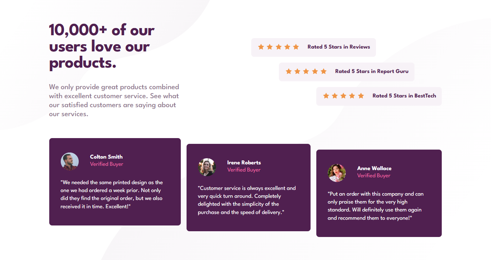
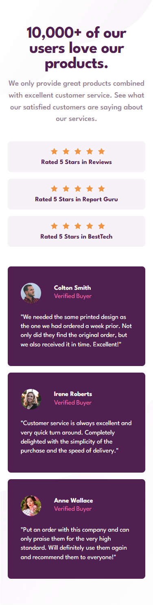

# Social Proof Section ⭐

A clean and responsive **social proof section** that showcases user testimonials with a modern and minimalistic design. This component is perfect for building credibility and enhancing user trust in a product or service.

## 🚀 Live Demo  
[View Social Proof Section](https://bhavikthakur.github.io/social-proof-section/) 

## 📸 Preview  
  
   

## 🛠️ Tech Stack  
- **HTML5** - Semantic and accessible markup  
- **CSS3** - Modern styling with Flexbox and Grid  
- **Google Fonts (League Spartan)** - Elegant and readable typography  

## 🎨 Features  
✅ Fully responsive (mobile, tablet, desktop)  
✅ Flexbox-based layout for structured content  
✅ Clean and modern typography  
✅ Accessible and optimized for all screen sizes  

## 📂 Folder Structure  

/project-folder <br>
│── /css <br>
│   ├── reset.css        # Resets default browser styles <br>
│   ├── styles.css       # Main styling file <br>
│   ├── media-queries.css # Responsive styles <br>
│── /images             # Contains all images & icons <br>
│── index.html          # Main HTML file <br>
│── README.md           # Documentation <br>

## 🔧 Setup & Usage  
1. Clone this repository:  
   ```bash
   git clone https://github.com/YOUR_GITHUB_USERNAME/social-links-profile.git    
2. Open index.html in your browser.

2. Open `index.html` in a browser.  
3. Customize styles in `css/styles.css` if needed.  

## 📢 Future Enhancements  
- Add animations for a smoother user experience 🎨  
- Implement dark mode support 🌙  
- Expand with additional testimonials and layout variations  

## 🤝 Connect With Me  
👨‍💻 GitHub: [bhavikthakur](https://github.com/bhavikthakur)  <br>
💼 LinkedIn: [Bhavik Thakur](https://www.linkedin.com/in/bhavik-thakur/)  <br>
🐦 Twitter: [Bhavik Thakur](https://x.com/BhavikkThakur)  <br>

---
🌟 *"Great design builds great trust."*  
